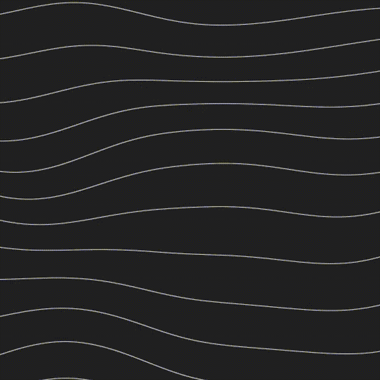

# **waves**
## Animated wave lines/mesh.
## **In Action**



+ [Live demo](https://bouvanni.github.io/waves)
+ [Codepen](https://codepen.io/andrisjms/pen/mdObZvx)
## **Usage**
```html
<!-- Noise library -->
<script src="https://assets.codepen.io/127738/perlin.js"></script>
<!-- Waves file -->
<script src="path/to/file/script.js"></script>
```
## **Parameters**
### **bgColor**
*Specifies the background color behind wave lines.*
### **lineColor**
*Specifies the color of wave lines.*
### **lineWeight**
*Specifies the width of lines.*
### **lineHeight**
*Specifies the height between lines.*
### **noiseHeight**
*Specifies how much the line can be adjusted vertically.*
### **speedX**
*Specifies how fast the waves are changing in horizontally.*
### **speedY**
*Specifies how fast the waves are changing in vertically.*
### **noiseMultiplier**
*Specifies the zoom into the noise.*
